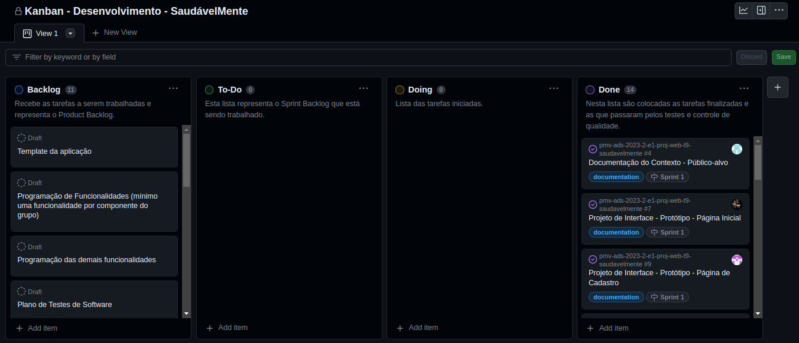
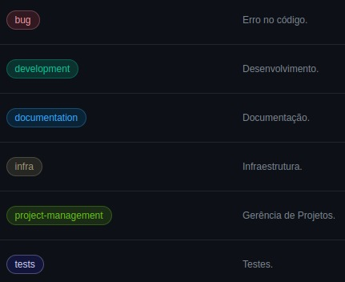

# Metodologia

## Gerenciamento de Projeto

A metodologia ágil escolhida para o desenvolvimento deste projeto foi o SCRUM, pois como citam Amaral, Fleury e Isoni (2019, p. 68), seus benefícios são a

“visão clara dos resultados a entregar; ritmo e disciplina necessários à execução; definição de papéis e responsabilidades dos integrantes do projeto (Scrum Owner, Scrum Master e Team); empoderamento dos membros da equipe de projetos para atingir o desafio; conhecimento distribuído e compartilhado de forma colaborativa; ambiência favorável para crítica às ideias e não às pessoas.”

### Divisão de Papéis

Desta forma, a equipe está organizada da seguinte maneira:

- Scrum Master: William Rodrigues
- Product Owner: Penélope Ventura
- Equipe de Desenvolvimento: William Rodrigues, Mariane Barzagli, Penélope Ventura, Vinicius Santos, Luan Santos, João Santos
- Equipe de Design: Mariane Barzagli, Luan Santos, William Rodrigues

### Processo

Para organização e distribuição das tarefas do projeto, a equipe está utilizando o GitHub Projects, estruturado com as seguintes listas:

- **Backlog**: recebe as tarefas a serem trabalhadas e representa o Product Backlog. Todas as atividades identificadas no decorrer do projeto também são incorporadas a esta lista. 
- **To-Do**: esta lista representa o Sprint Backlog que está sendo trabalhado.
- **Doing**: lista das tarefas iniciadas.
- **Done**: nesta lista são colocadas as tarefas finalizadas e as que passaram pelos testes e controle de qualidade, prontas para serem entregues aos usuários.

> O quadro do GitHub no formato **Kanban** está diponível [aqui](https://github.com/orgs/ICEI-PUC-Minas-PMV-ADS/projects/619) e é apresentado, no estado atual, na figura abaixo:

<figure> 
  
  <figcaption>
    Figura 1 - Tela do Kanban no GitHub utilizada pelo grupo
  </figcaption>
</figure> 

### Etiquetas

As tarefas são, ainda, etiquetadas em função da natureza da atividade e seguem o seguinte esquema de cores/categorias:

- `bug` (Erro no código)
- `development` (Desenvolvimento)
- `documentation` (Documentação)
- `project-management` (Gerência de Projetos)
- `infra` (Infraestrutura)
- `tests` (Testes)

<figure> 
  
  <figcaption>
    Figura 2 - Tela do esquema de cores e categorias
  </figcaption>
</figure> 
  
### Ferramentas

As ferramentas empregadas no projeto são:

- Editor de código ([VS Code](https://code.visualstudio.com/)).
- Ferramentas para versionamento de código ([Git](https://git-scm.com/), [GitHub Desktop](https://desktop.github.com/), e o próprio VS Code com a extensão do GitHub).
- Ferramentas de comunicação ([Teams](https://www.microsoft.com/pt-br/microsoft-teams/log-in)).
- Ferramentas de desenho de tela ([Figma](https://www.figma.com/)).

O editor de código foi escolhido porque ele possui uma integração com o sistema de versionamento de código escolhido. As ferramentas de comunicação utilizadas possuem integração semelhante e por isso foram selecionadas. Por fim, para criar protótipos e wireframes utilizamos essa ferramenta por melhor captar as necessidades da nossa solução.

Os artefatos do projeto são desenvolvidos a partir das plataformas [GitHub](https://github.com/) e o [Figma](https://www.figma.com/), apresentadas com seus respectivos propósitos na tabela que se segue.

| AMBIENTE | PLATAFORMA | LINK DE ACESSO |
| --- | --- | --- |
| Repositório de código fonte | GitHub | https://github.com/ICEI-PUC-Minas-PMV-ADS/pmv-ads-2023-2-e1-proj-web-t9-saudavelmente/tree/main/codigo-fonte |
| Documentos do projeto | GitHub | https://github.com/ICEI-PUC-Minas-PMV-ADS/pmv-ads-2023-2-e1-proj-web-t9-saudavelmente/tree/main/documentos |
| Projeto de Interface e Wireframes | Figma | https://www.figma.com/proto/qGbpPPBEY2diO4EH8Mtg6y/Projeto---Eixo-01%2FTurma-09---Saud%C3%A1velMente?type=design&node-id=160-2&t=35jnyTSFn2OStKPg-1&scaling=min-zoom&page-id=0%3A1&starting-point-node-id=160%3A2&mode=design |
| Gerenciamento do Projeto | GitHub Projects | https://github.com/orgs/ICEI-PUC-Minas-PMV-ADS/projects/619 |
| Hospedagem | GitHub Pages | Em andamento... |

### Estratégia de Organização de Codificação 

Todos os artefatos relacionados a implementação e visualização dos conteúdos do projeto da aplicação foram inseridos na pasta [`codigo-fonte`](../codigo-fonte/).
