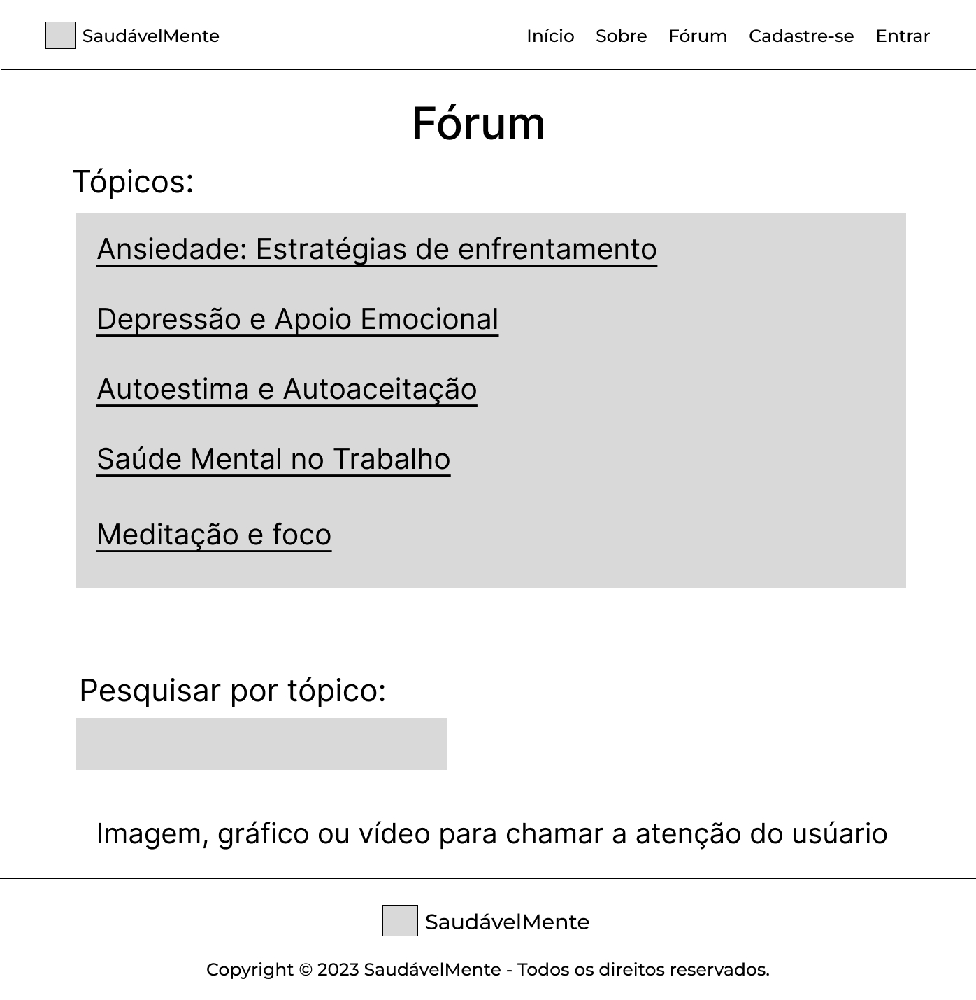
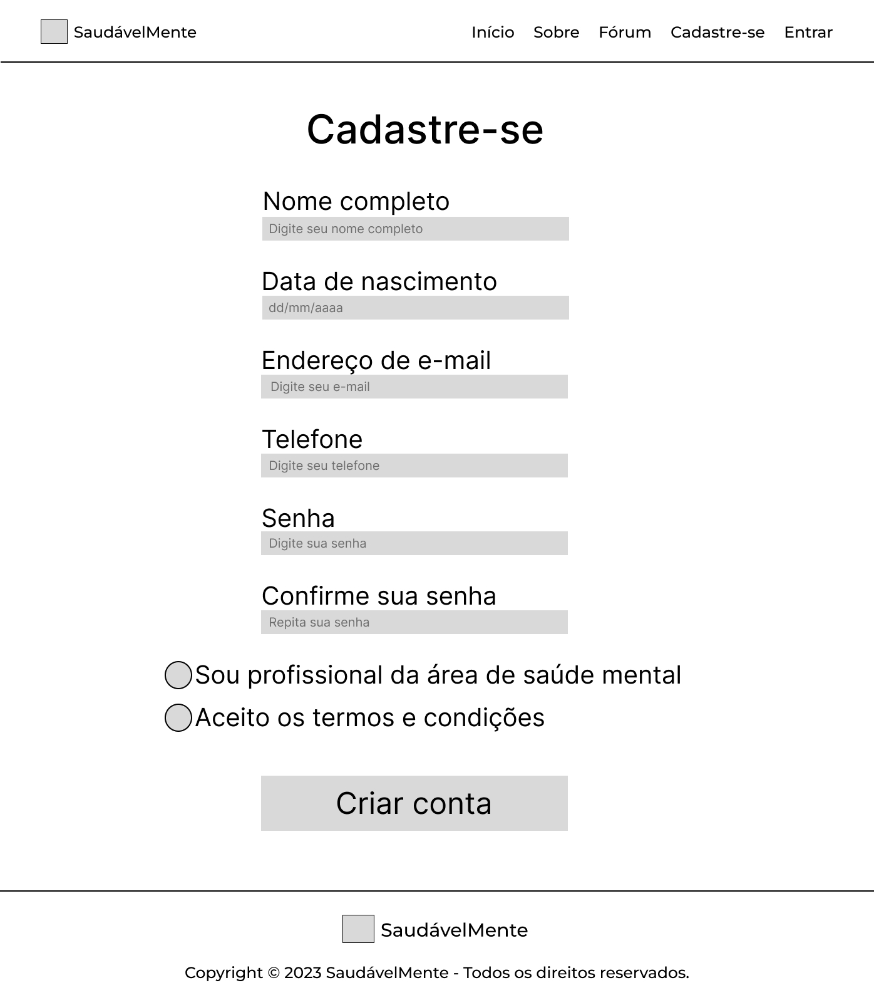
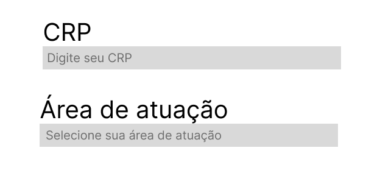
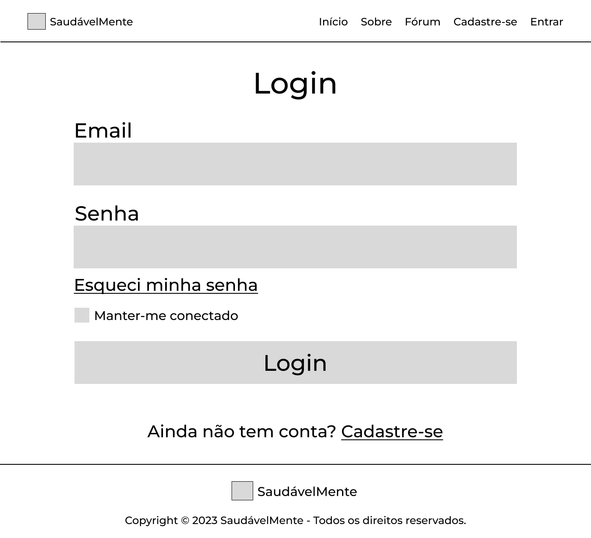
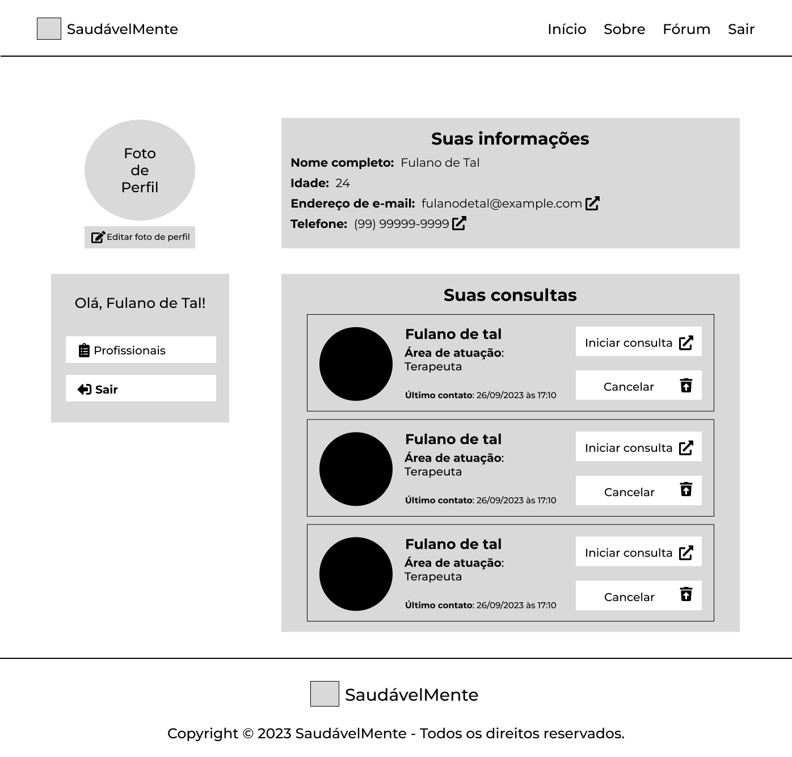
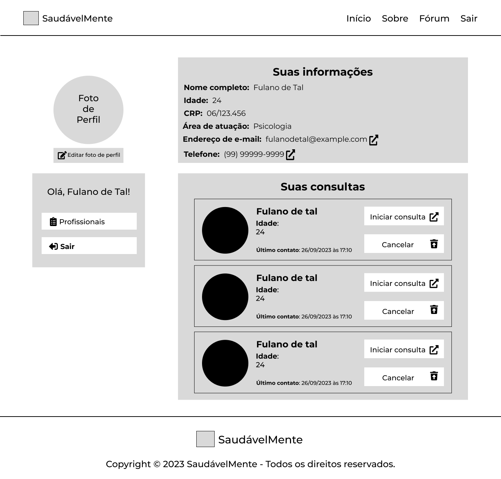
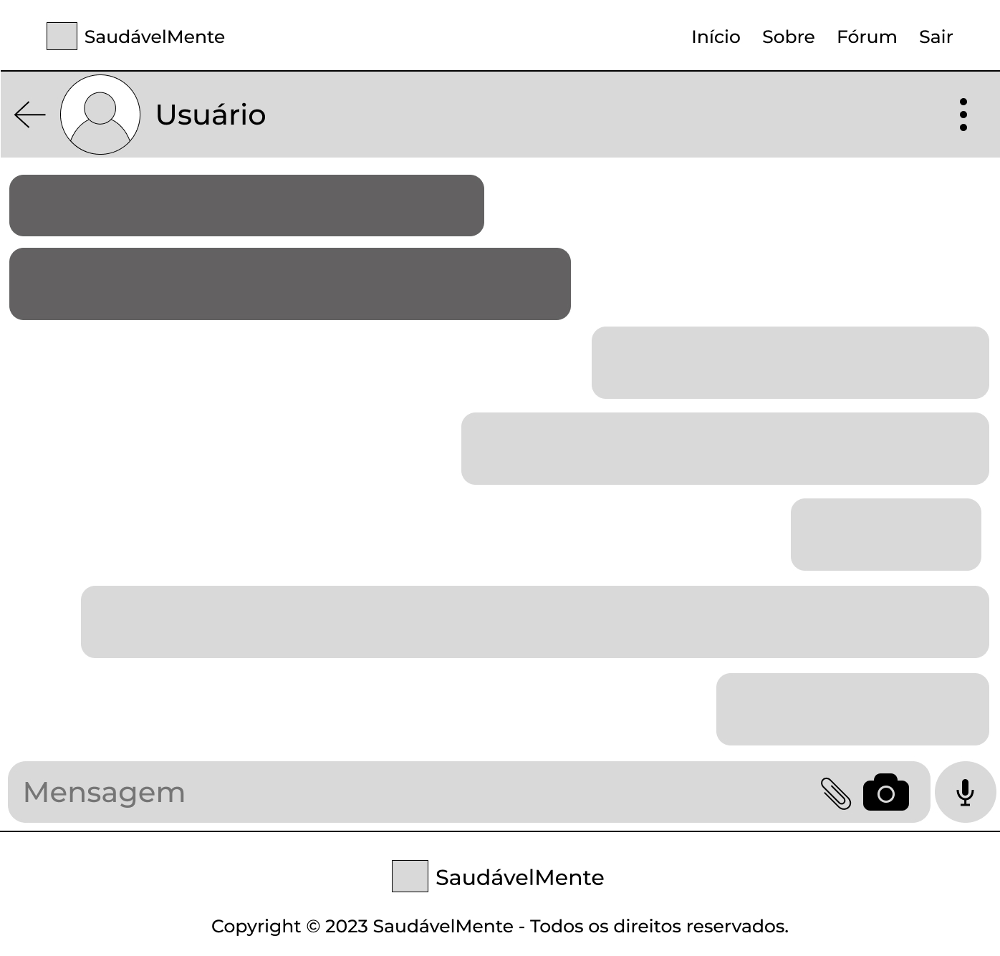

# Projeto de Interface

## User Flow

O Fluxo de Usuário (User Flow) apresentado na **Figura 1** mostra o mapeamento do fluxo de navegação do usuário na aplicação entre as telas. Ela serve para alinhar os caminhos e as possíveis ações que o usuário pode fazer. Cada uma das telas descritas aqui está detalhada na seção de [Prótotipo de Baixa Fidelidade](#protótipo-de-baixa-fidelidade) que se segue. Para visualizar o protótipo interativo, acesse [esse link](https://www.figma.com/proto/qGbpPPBEY2diO4EH8Mtg6y/Projeto---Eixo-01%2FTurma-09---Saud%C3%A1velMente?type=design&node-id=160-2&t=35jnyTSFn2OStKPg-1&scaling=min-zoom&page-id=0%3A1&starting-point-node-id=160%3A2&mode=design) que levará para a protótipação feita no Figma.

<figure> 
  
  <figcaption>Figura 1 - Fluxo de Telas do Usuário</figcaption>
</figure>

## Protótipo

### Protótipo de baixa fidelidade

Protótipos de baixa fidelidade apresentam de forma simplificada o design da interface e o relacionamento entre suas páginas, permitindo evolução da proposta da solução. Neste projeto, eles serão utilizados para apoiar a validação dos requisitos e efetuar mudanças dos mesmos, caso seja necessário, para menor impacto na codificação da aplicação.

As telas do sistema apresentam uma estrutura comum que é apresentada na **Figura 2**. Nesta estrutura existem 3 grandes blocos, descritos a seguir. São eles:

- **Cabeçalho** - local onde estão dispostos o nome da aplicação web e navegação principal do site (menu da aplicação);
- **Conteúdo** - apresenta o conteúdo da tela em questão;
- **Rodapé** - apresenta informações sobre os direitos autorais, entre outras informações relevantes.

<figure> 
  
  <figcaption>Figura 2 - Estrutura padrão do site</figcaption>
</figure>

### Telas

Em todas as telas o menu do cabeçalho irá sofrer uma pequena mudança quando o usuário estiver logado, ele ficará assim:

<figure> 
  
  <figcaption>Figura 3 - Header com o usuário logado</figcaption>
</figure>

---

#### Tela - Página Inicial

A tela de **Página Inicial** será o ponto inicial de qualquer usuário da plataforma. Nela estará presente:

- Um banner de boas vindas visando convidar o usuário à entender melhor o objetivo do projeto;
- Uma breve seção sobre as serviços oferecidos e o que o usuário poderá encontrar na plataforma;
- Uma seção com depoimentos de pacientes e profissionais da área de saúde sobre a plataforma;
- Uma breve explicação sobre o projeto e avisos legais.
- A partir dela você também poderá navegar para todos as páginas públicas do site tais como:
  - Página de cadastro;
  - Página de login;
  - Página do fórum.

<figure> 
  
  <figcaption>Figura 4 - Tela Página Inicial</figcaption>
</figure>

---

#### Tela - Fórum

A tela de **Fórum** exibirá os tópicos e posts já criados pelos usuários da plataforma.

Nessa tela, está contido as seguintes aplicabilidades:

- Pesquisa por tópicos e posts;
- Os tópicos e os posts publicados.

<figure> 
  
  <figcaption>Figura 5 - Tela Página do Fórum</figcaption>
</figure>

---

#### Tela - Cadastro

A tela de **Cadastro**  apresentará os seguintes campos para a inserção das informações pessoais do usuário:

- Nome Completo;
- Data de Nascimento; 
- E-mail;
- Telefone; 
- Senha; 
- Confirmação de Senha;
- Aceite dos Termos e Condições de Uso. 

Além disso, haverá uma opção para os profissionais da área da saúde  clicarem e, em seguida, inserirem mais duas informações para se cadastrarem:

- CRM;
- Área de Atuação.

<figure> 
  
  <figcaption>Figura 6 - Tela de Cadastro</figcaption>
</figure>

<figure> 
  
  <figcaption>Figura 7 - Campos adicionais para Informação Profissional</figcaption>
</figure>

---

#### Tela - Login

A tela de **Login** exibirá os campos para o usuário realizar o preenchimento dos dados anteriormente cadastrados.

Na tela de Login estarão presentes as seguintes aplicabilidades:

- Campo para preehcimento de Email;
- Campo para preenchimento de Senha;
- Opção para recuperar senha esquecida;
- Função de manter-se conectado ao site;
- Após o sistema realizar a validação das informações e efetuar o login, o usuário será redirecionado para a pagina de perfil;
- A tela também irá conter a funcionalidade de retornar a pagina de cadastro para os usuários que ainda não o tiverem feito previamente.

<figure> 
  
  <figcaption>Figura 8 - Tela Página de Login</figcaption>
</figure>

---

#### Tela - Perfil de Usuário

A tela de **Perfil de Usuário** exibirá informações do perfil do usuário.

Além disso, essa tela irá variar dependendo do usuário logado, segue então as telas para quando o paciente está logado, e logo em seguida a tela de quando o profissional está logado.

Nessa tela, está contido as seguintes aplicabilidades:

- Foto de Perfil do usuário para ele editar quando quiser;
- Um botão para acesso de todos os profissionais da plataforma;
- Opção para sair do site;
- As informações do usuário;
- Detalhes específicos sobre as consultas, como especialidade, nome do especialista e data do último contato;
- A partir das consultas o usuário poderá também iniciar uma consulta rápida via chat com um profissional ou descartar essa consulta.

<figure> 
  
  <figcaption>Figura 9 - Tela Página de Perfil do Usuário (<b>Paciente</b>)</figcaption>
</figure>

<figure> 
  
  <figcaption>Figura 10 - Tela Página de Perfil do Usuário (<b>Profissional</b>)</figcaption>
</figure>

---

#### Tela - Chat

A tela de **Chat** permitirá comunicação em tempo real entre usuários. Com as seguintes funcionalidades:

- Enviar e receber mensagens instantaneamente, texto e voz;
- Anexarem imagens, vídeos, documentos e outros arquivos;
- Notificar sobre mensagens não lidas ou novas atividades;
- Criptografia de ponta a ponta para garantir a privacidade e segurança das mensagens;
- Armazenar mensagens antigas e permitir que os usuários pesquisem no histórico do chat;
- Mostrar se um usuário está online, offline, ocupado, etc.

<figure> 
  
  <figcaption>Figura 11 - Tela Chat</figcaption>
</figure>

---

#### Tela - Lista de Profissionais

A tela de **Lista de Profissionais** exibirá todos os profissionais cadastrados na platafoma, com um campo de pesquisa para filtrar os profissionais. Ela estará disponível para acesso ao usuário logado em usa página de perfil. Nela estará presente:

- Cards para cada profissional cadastrado, e detalhes como área de atuação, descrição, etc...;
- Nos cards, você poderá adicionar o profissional à sua lista de profissionais que você gostaria de ter uma consulta via chat;
- Terá uma forma do usuário voltar para a página de perfil do mesmo.

<figure> 
  
  <figcaption>Figura 12 - Tela Lista de Profissionais</figcaption>
</figure>
