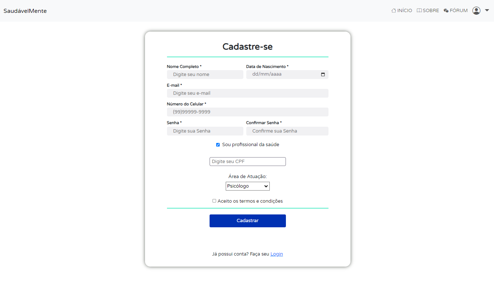
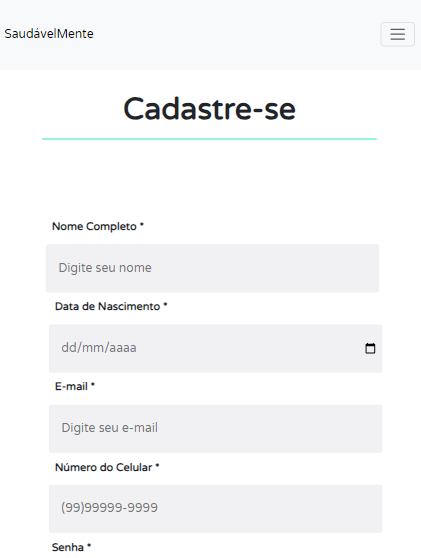
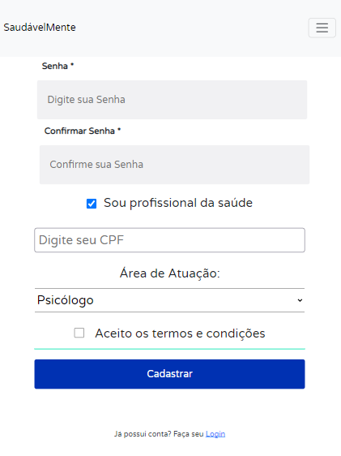
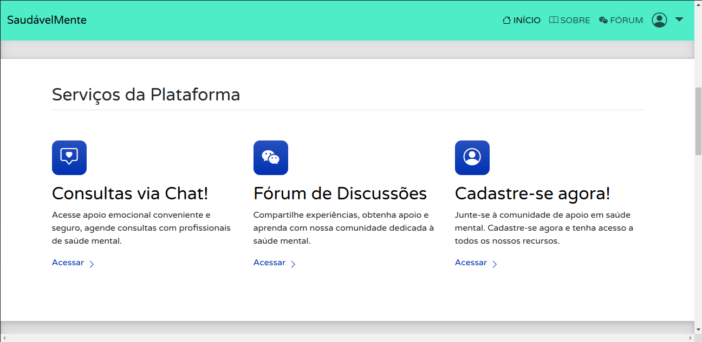

# Programação de Funcionalidades

Implementação da aplicação descritas por meio dos requisitos codificados.

Pré requisitos:

- [Especificação do Projeto](./02-Especificação%20do%20Projeto.md)
- [Metologia](./03-Metodologia.md)
- [Projeto de Interface](./04-Projeto%20de%20Interface.md)
- [Template Padrão da Aplicação](./05-Template%20padrão%20da%20Aplicação.md)

### Funcionalidade na Tela de Cadastro (RF-01)

Responsável: **João Pedro Campos Carvalho dos Santos**

<figure> 
  
  <figcaption>Figura 1 - Print da funcionalidade na Tela de Cadastro</figcaption>
</figure>

<figure> 
  
  
  <figcaption>Figura 1.2 - Funcionalidade na Tela de Cadastro Mobile</figcaption>
</figure>

#### Requisito atendido

**RF-01**: A plataforma deve permitir ao usuário cadastrar uma conta.

#### Artefatos da funcionalidade

Adicione os nomes dos arquivos relacionados ao desenvolvimento da funcionalidade no seguinte formato:

- index.html
- styles.css
- script.js

#### Instruções de acesso

1. Abra um navegador de internet (em um computador ou em um celular);
2. Acesse a [página de cadastro](https://icei-puc-minas-pmv-ads.github.io/pmv-ads-2023-2-e1-proj-web-t9-saudavelmente/codigo-fonte/paginas/cadastro/) da aplicação;
3. Forneça as informações necessárias no formulário de cadastro;
4. O usuário terá sua conta criada.

---

### Funcionalidade na Tela de Login (RF-02)

Responsável: **Nome Completo do Aluno**

<figure> 
  
  <figcaption>Figura 2 - Print da funcionalidade na Tela de Login</figcaption>
</figure>

#### Requisito atendido

**RF-02**: A plataforma deve permitir ao usuário fazer login na sua conta.

#### Artefatos da funcionalidade

Adicione os nomes dos arquivos relacionados ao desenvolvimento da funcionalidade no seguinte formato:

- index.html
- styles.css
- script.js

#### Estrutura de Dados

[Caso exista estrutura de dados, adicione aqui]

#### Instruções de acesso

1. Abra um navegador de internet (em um computador ou em um celular);
2. Acesse a [página de login](#link-site-hospedado) da aplicação;
3. Forneça as informações necessárias no formulário de login;
4. Ao fornecer as informações corretas de sua conta, a autenticação deverá ser feita e o usuário estará logado.

---

### Funcionalidade na Tela de Lista de Profissionais (RF-03)

Responsável: **William da Silva Rodrigues**

<figure> 
  
  <figcaption>Figura 3 - Funcionalidade na Tela de Lista de Profissionais</figcaption>
</figure>

<figure> 
  
  <figcaption>Figura 3.1 - Funcionalidade na Tela de Lista de Profissionais Mobile</figcaption>
</figure>

#### Requisito atendido

**RF-03**: A plataforma deve fornecer uma lista de profissionais com possibilidade de pesquisa, permitindo que os usuários escolham um profissional alinhado com suas necessidades.

#### Artefatos da funcionalidade

- index.html
- styles.css
- script.js

#### Instruções de acesso

1. Abra um navegador de internet (em um computador ou em um celular);
2. Acesse a [página de login](https://icei-puc-minas-pmv-ads.github.io/pmv-ads-2023-2-e1-proj-web-t9-saudavelmente/codigo-fonte/paginas/login/) da aplicação;
3. Forneça as informações necessárias no formulário de login;
4. Ao fornecer as informações corretas de sua conta, a autenticação deverá ser feita e o usuário estará logado e será redirecionado para a página de perfil;
5. No canto esquerdo do dashboard, o usuário poderá acessar a página de lista de profissionais ao clicar em "Profissionais".

---

### Funcionalidade na Tela de Chat (RF-04)

Responsável: **Nome Completo do Aluno**

<figure> 
  
  <figcaption>Figura 4 - Print da funcionalidade na Tela de Chat</figcaption>
</figure>

#### Requisito atendido

**RF-04**: A plataforma deve permitir que os usuários tenham suas consultas.

#### Artefatos da funcionalidade

Adicione os nomes dos arquivos relacionados ao desenvolvimento da funcionalidade no seguinte formato:

- index.html
- styles.css
- script.js

#### Estrutura de Dados

[Caso exista estrutura de dados, adicione aqui]

#### Instruções de acesso

1. Abra um navegador de internet (em um computador ou em um celular);
2. Acesse a [página de login](#link-site-hospedado) da aplicação;
3. Forneça as informações necessárias no formulário de login;
4. Ao fornecer as informações corretas de sua conta, a autenticação deverá ser feita e o usuário estará logado e será redirecionado para a página de perfil;
5. O usuário poderá visualizar uma lista de consultas na página de perfil;
6. O usuário poderá acessar o chat de consulta ao clicar em "Iniciar consulta" para que ele seja redirecionado ao chat de sua consulta com o profissional.

---

### Funcionalidade na Tela Perfil do Usuário (RF-05)

Responsável: **Nome Completo do Aluno**

<figure> 
  
  <figcaption>Figura 5 - Print da funcionalidade na Tela de Perfil do Usuário</figcaption>
</figure>

#### Requisito atendido

**RF-05**: Os usuários devem ter acesso a uma seção em sua conta para exibir informações do seu perfil.

#### Artefatos da funcionalidade

Adicione os nomes dos arquivos relacionados ao desenvolvimento da funcionalidade no seguinte formato:

- index.html
- styles.css
- script.js

#### Estrutura de Dados

[Caso exista estrutura de dados, adicione aqui]

#### Instruções de acesso

1. Abra um navegador de internet (em um computador ou em um celular);
2. Acesse a [página de login](#link-site-hospedado) da aplicação;
3. Forneça as informações necessárias no formulário de login;
4. Ao fornecer as informações corretas de sua conta, a autenticação deverá ser feita e o usuário estará logado e será redirecionado para a página de perfil;
5. O usuário poderá visualizar suas informações.

---

### Funcionalidade na Tela de Página Inicial (RF-06)

Responsável: **William da Silva Rodrigues**

<figure> 
  
  <figcaption>Figura 6 - Funcionalidade na Tela de Página Inicial</figcaption>
</figure>

<figure> 
  
  <figcaption>Figura 6.1 - Funcionalidade na Tela de Página Inicial Mobile</figcaption>
</figure>

#### Requisito atendido

**RF-06**: A plataforma deve ter uma página inicial com informações claras sobre sua missão, valores e funcionalidades oferecidas.

#### Artefatos da funcionalidade

- index.html
- styles.css
- script.js

#### Instruções de acesso

1. Abra um navegador de internet (em um computador ou em um celular);
2. Acesse a [página inicial](https://icei-puc-minas-pmv-ads.github.io/pmv-ads-2023-2-e1-proj-web-t9-saudavelmente/codigo-fonte/paginas/pagina-inicial/) da aplicação.
   
---

### Funcionalidade na Tela de Fórum (RF-07)

Responsável: **Nome Completo do Aluno**

<figure> 
  
  <figcaption>Figura 7 - Print da funcionalidade na Tela de Fórum</figcaption>
</figure>

#### Requisito atendido

**RF-07**: A plataforma deve apresentar uma página principal do fórum onde os tópicos são listados. Caso haja muitos tópicos, eles devem ser divididos em páginas para facilitar a navegação

#### Artefatos da funcionalidade

Adicione os nomes dos arquivos relacionados ao desenvolvimento da funcionalidade no seguinte formato:

- index.html
- styles.css
- script.js

#### Estrutura de Dados

[Caso exista estrutura de dados, adicione aqui]

#### Instruções de acesso

1. Abra um navegador de internet (em um computador ou em um celular);
2. Acesse a [página do fórum](#link-site-hospedado) da aplicação;
3. O usuário irá visualizar os tópicos e posts já criados.

---

### Funcionalidade na Tela de Fórum (RF-08)

Responsável: **Nome Completo do Aluno**

<figure> 
  
  <figcaption>Figura 7 - Print da funcionalidade na Tela de Fórum</figcaption>
</figure>

#### Requisito atendido

**RF-08**:Os usuários devem ter acesso a uma barra de pesquisa no fórum onde podem digitar palavras-chave. Ao realizar a pesquisa, os resultados relevantes devem ser exibidos

#### Artefatos da funcionalidade

Adicione os nomes dos arquivos relacionados ao desenvolvimento da funcionalidade no seguinte formato:

- index.html
- styles.css
- script.js

#### Estrutura de Dados

[Caso exista estrutura de dados, adicione aqui]

#### Instruções de acesso

1. Abra um navegador de internet (em um computador ou em um celular);
2. Acesse a [página do fórum](#link-site-hospedado) da aplicação;
3. O usuário irá visualizar uma campo de pesquisa, onde o mesmo poderá fazer pesquisas em todo o fórum.
