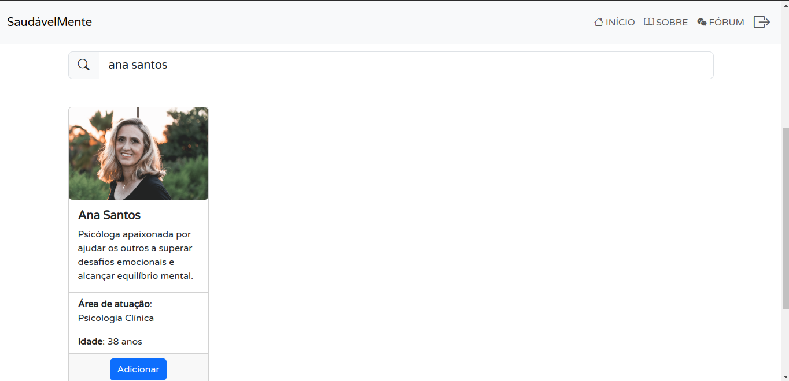
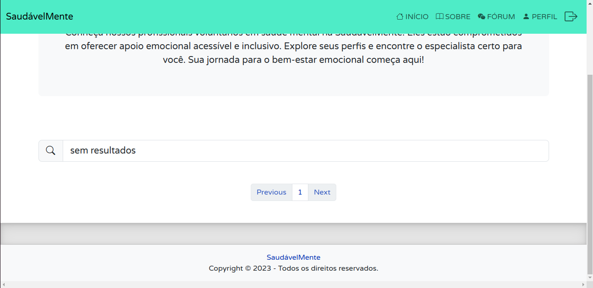
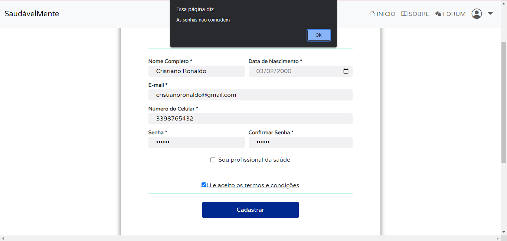
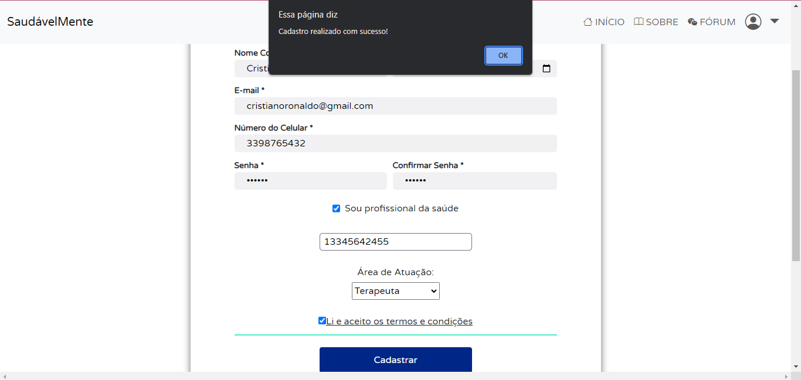
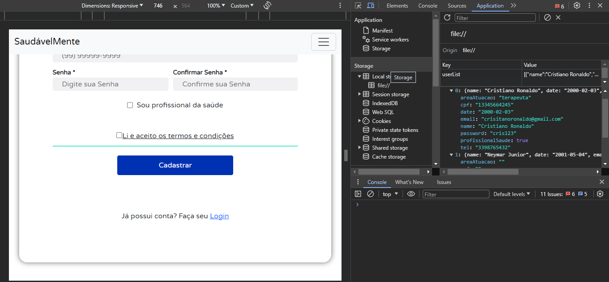

# Registro de Testes de Software

Pré-requisitos:
- [Projeto de Interface](./04-Projeto%20de%20Interface.md)
- [Plano de Testes de Software](./07-Plano%20de%20Testes%20de%20Software.md)

Relatório com as evidências dos testes de software realizados na aplicação pela equipe, baseado no plano de testes pré-definido.

Os resultados dos testes funcionais realizados na aplicação são descritos a seguir.

### CT-03: Verificar o funcionamento do filtro de pesquisa da página de Profissionais

**Responsável**: William da Silva Rodrigues
    
- Filtro com resultados:
    

        
    

- Filtro sem resultados:
    

        
    

---

### CT-04: Verificar o cadastro de usuários.

**Responsável**: João Pedro Campos Carvalho dos Santos

- Usuário preenche os campos "Senha" e "Confirmaçāo de Senha" com valores diferentes.
    

        
    

- Verificar se o usuário foi cadastrado.
    

        
    

- Informações armazenadas no LocalStorage após usuário se cadastrar.
     

        
    

---
