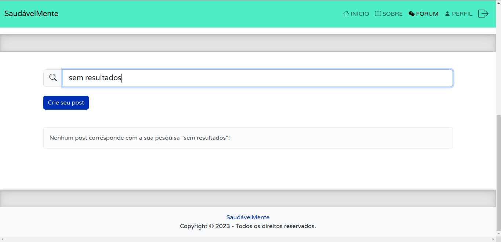
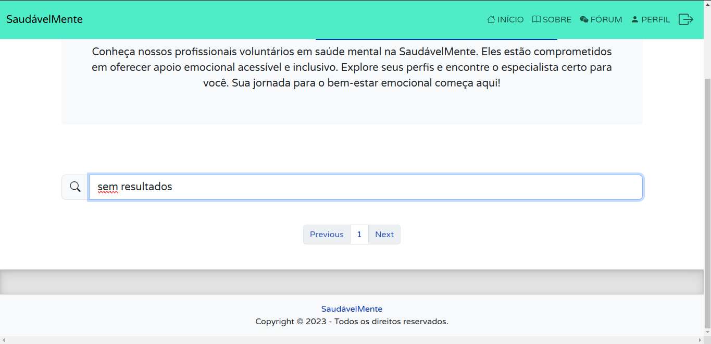
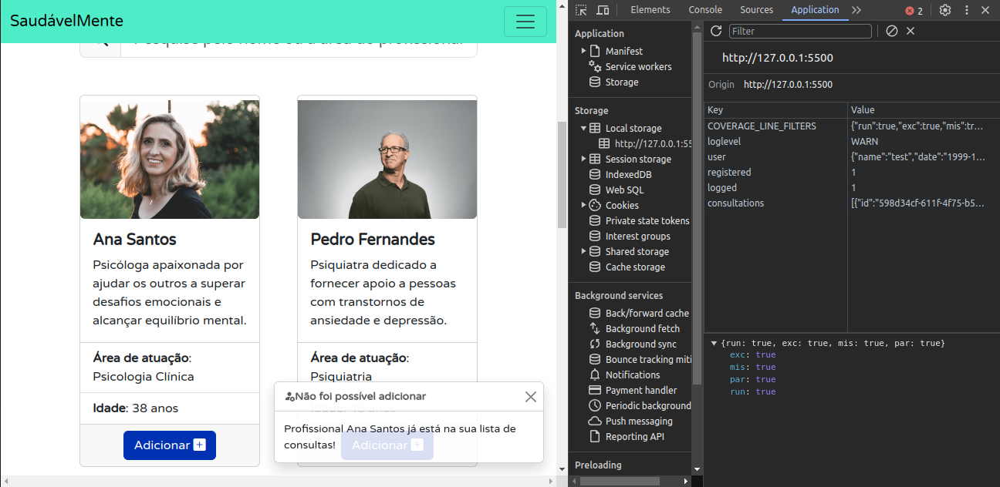
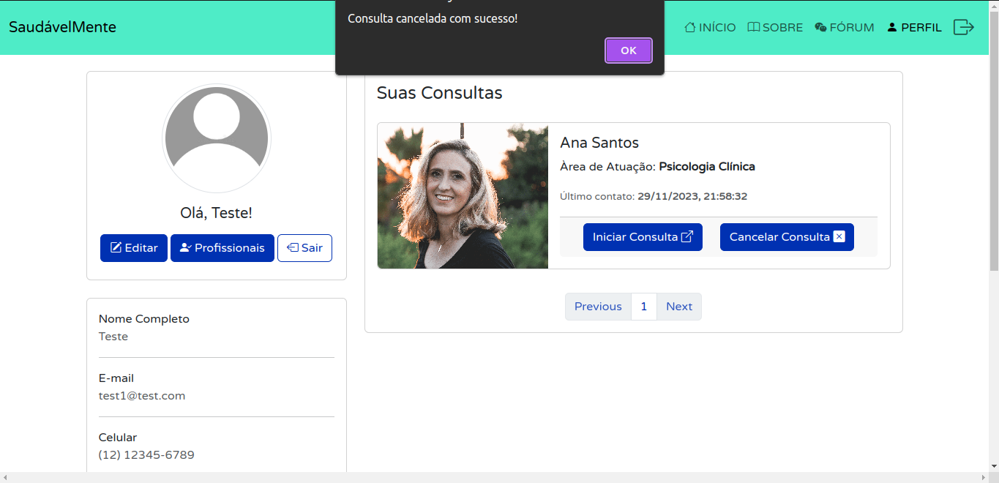
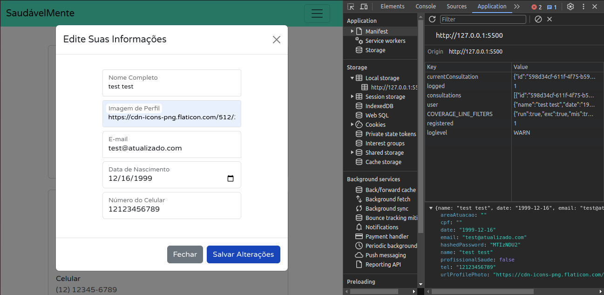
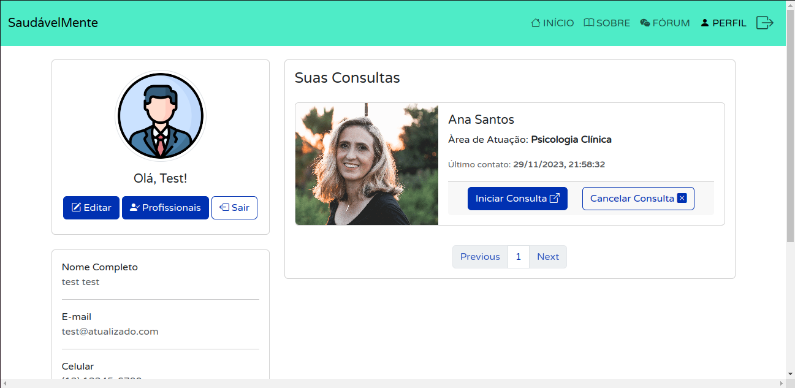
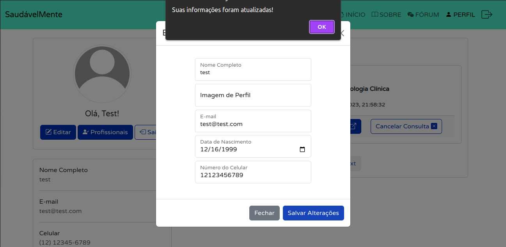
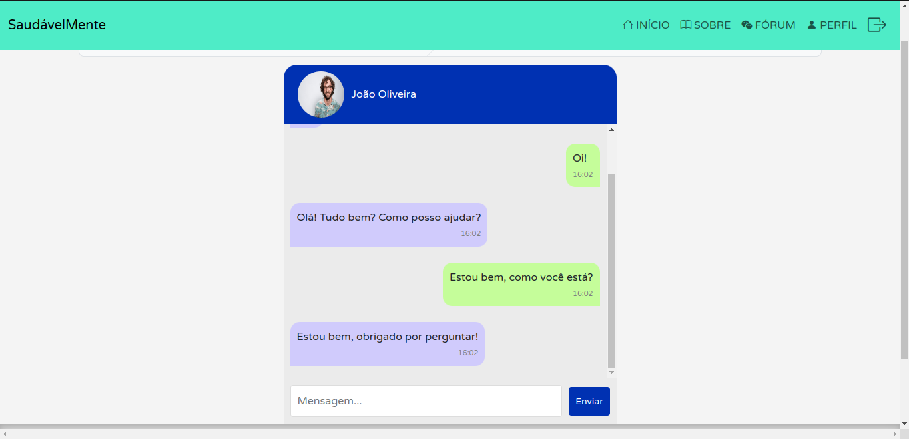

# Registro de Testes de Software

Pré-requisitos:
- [Projeto de Interface](./04-Projeto%20de%20Interface.md)
- [Plano de Testes de Software](./07-Plano%20de%20Testes%20de%20Software.md)

Relatório com as evidências dos testes de software realizados na aplicação pela equipe, baseado no plano de testes pré-definido.

Os resultados dos testes funcionais realizados na aplicação são descritos a seguir:

### CT-01: Verificar o funcionamento dos links da Página Inicial

**Responsável**: William da Silva Rodrigues

- Navegação entre as páginas a partir da página inicial, como descrito no [Projeto de Interface](./04-Projeto%20de%20Interface.md):

---

### CT-02: Verificar o funcionamento do filtro de pesquisa da página do Fórum

**Responsável**: Vinícius Simões dos Santos

- Filtro com resultados:
    

        
    

- Filtro sem resultados:
    

        
    

---

### CT-03: Verificar o funcionamento do filtro de pesquisa da página de Profissionais

**Responsável**: William da Silva Rodrigues
    
- Filtro com resultados:
    

        
    

- Filtro sem resultados:
    

        
    

---

### CT-04: Verificar o cadastro de usuários

**Responsável**: João Pedro Campos Carvalho dos Santos

- Usuário preenche os campos "Senha" e "Confirmaçāo de Senha" com valores diferentes.
    

        
    

- Verificar se o usuário foi cadastrado.
    

        
    

- Informações armazenadas no LocalStorage após usuário se cadastrar.
     

        
    

---

### CT-05: Verificar o funcionamento de autorização e autenticação

**Responsável**: William da Silva Rodrigues

- Usuário existe no "banco de dados", e o email e a senha são corretamente digitados.
    

        
    

---

### CT-06: Verificar o funcionamento de autorização e autenticação em caso de falha

**Responsável**: William da Silva Rodrigues

- Usuário não existe no "banco de dados".
    

        
    

- Usuário digita senha ou email incorretamente.
    

        
    

---

### CT-07: Verificar adição de profissional na lista de consultas

**Responsável**: William da Silva Rodrigues

- Sucesso ao adicionar um profissional.
    

        
    

- Erro ao adicionar o profissional, pois já existe.
    

        
    

---

### CT-08: Verificar inicio e cancelamento de consultas

**Responsável**: William da Silva Rodrigues

- Ao Iniciar Consulta usuário deverá ser redirecionado para o chat da consulta e também a data de Último contato será atualizada.
    

        
    

    

        
    

    

        
    

- Ao cancelar uma consulta, a consulta será removida e uma mensagem será exibida.
    

        
    

    

        
    

---

### CT-09: Verificar edição de informações do usuário

**Responsável**: William da Silva Rodrigues

- Ao atualizar suas informações com sucesso, o objeto `user` deverá ser atualizado no localStorage.
    - Antes:
        

            
        

    - Depois:
        

            
        

- Ao atualizar suas informações com sucesso, a tela de perfil com as informações do usuário deverá ser atualizada com as informações novas.
    - Antes:
        

            
        

    - Depois:
        

            
        

- Ao atualizar suas informações com sucesso, uma mensagem deverá ser exibida.
    

        
    

---

### CT-10: Verificar inicio da consulta com o profissional

**Responsável**: Luan César Souza dos Santos

- Usuário inicia a sua consulta.
    

        
    

---

### CT-11: Verificar se a consulta atual é a mesma ao clicar em Iniciar Consulta

**Responsável**: Luan César Souza dos Santos

- Consulta a ser iniciada.
    

        
    

- Verificando no localStorage imagem e nome do profissional
    

        
    
